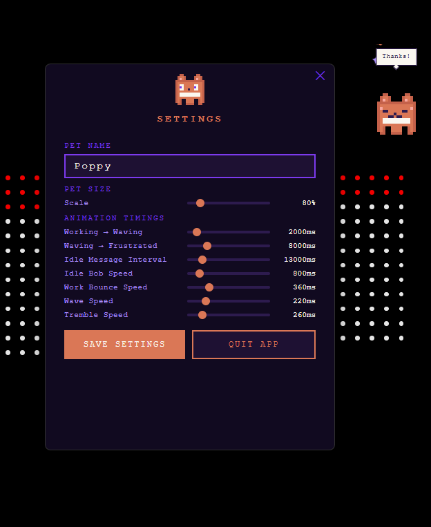

# Claude Code Pet 🐱

A pixel-art desktop companion that lives on your screen and reacts in real time to what Claude Code is doing. Built with Electron.



---

## Features

- **Real-time Claude Code integration** — reacts the moment you submit a prompt and relaxes when Claude finishes
- **Animated states** — idle bob, excited working bounce, frantic waving, frustrated tremble
- **Speech bubbles** — contextual messages based on what's happening ("Claude & Pixel working...", "Finally! Pixel can relax 😅")
- **Idle personality** — random speech bubbles every 20–45 seconds when nothing is happening
- **Left-click to pet** — wiggle animation with hearts ♥
- **Right-click to feed** — chomp animation with fish 🐟🍣 particles
- **Rename anytime** — right-click the system tray icon → Rename Pet
- **Always on top** — floats over all windows, fully draggable
- **Click-through** — transparent areas don't block your mouse

---

## How It Works

The pet runs as a small Electron app. Claude Code integration is done via **hooks** — Claude Code fires shell commands at key moments, which POST events to a tiny HTTP server the pet runs on `localhost:7523`.

```
You submit a prompt
  → UserPromptSubmit hook fires
  → POST { type: "prompt_submit" } → localhost:7523
  → Pet goes WORKING (excited bounce)
    → 3s later: WAVING (frantic arm wave)
    → 10s later: FRUSTRATED (angry tremble)

Claude finishes responding
  → Stop hook fires
  → POST { type: "stop" } → localhost:7523
  → Pet returns to IDLE
  → Speech bubble based on how long it took:
      < 3s  → no bubble
      3–10s → "Done!" / "That was quick!"
      > 10s → "Finally! [Name] can relax 😅"
```

### Pet States

| State | Trigger | Animation | Face |
|---|---|---|---|
| **Idle** | Default | Gentle bob | Eyes open |
| **Working** | Prompt submitted (0–3s) | Fast bounce | Excited wide eyes |
| **Waving** | Still running after 3s | Frantic wave + speed lines | Sweat drop |
| **Frustrated** | Still running after 10s | Gentle tremble | Angry brows |
| **Petting** | Left-click | Wiggle + hearts | Happy squint |
| **Feeding** | Right-click | Chomp | Happy squint |

---

## Installation

### Prerequisites

- [Node.js](https://nodejs.org/) v18+
- [Claude Code](https://claude.ai/code) CLI installed

### Steps

**1. Clone the repo**
```bash
git clone https://github.com/ParthBadkul/claude-code-pet.git
cd claude-code-pet
```

**2. Install dependencies**
```bash
npm install
```

**3. Start the pet**
```bash
npm start
```

On first launch a setup window will ask you to name your pet.

**4. Add Claude Code hooks**

Add the following to `~/.claude/settings.json` (create it if it doesn't exist):

```json
{
  "hooks": {
    "UserPromptSubmit": [
      {
        "hooks": [
          {
            "type": "command",
            "command": "node -e \"try{var h=require('http');var r=h.request({hostname:'127.0.0.1',port:7523,path:'/event',method:'POST',headers:{'Content-Type':'application/json'}},function(){});r.on('error',function(){});r.end('{\\\"type\\\":\\\"prompt_submit\\\"}');}catch(e){}\""
          }
        ]
      }
    ],
    "Stop": [
      {
        "hooks": [
          {
            "type": "command",
            "command": "node -e \"try{var h=require('http');var r=h.request({hostname:'127.0.0.1',port:7523,path:'/event',method:'POST',headers:{'Content-Type':'application/json'}},function(){});r.on('error',function(){});r.end('{\\\"type\\\":\\\"stop\\\"}');}catch(e){}\""
          }
        ]
      }
    ]
  }
}
```

> If you already have a `settings.json`, just merge the `hooks` block in.

That's it — the pet will now react every time you use Claude Code.

---

## Usage

| Action | Result |
|---|---|
| **Left-click** the pet | Petting — wiggle + hearts + speech bubble |
| **Right-click** the pet | Feeding — chomp + 🐟 particles + speech bubble |
| **Drag** the pet | Move it anywhere on screen |
| **Tray icon → Settings…** | Open settings panel (name, pet size, animation timings) |
| **Tray icon → Quit** | Exit the app |

---

## Building a Distributable

```bash
# Windows (.exe installer + portable)
npm run build:win

# macOS (.dmg)
npm run build:mac

# Both
npm run build
```

Output goes to the `dist/` folder.

---

## Tech Stack

- **Electron** — desktop shell
- **Vanilla JS + Canvas API** — pixel art rendering, no frameworks
- **Node.js `http` module** — lightweight hook server
- **Claude Code hooks** — `UserPromptSubmit` + `Stop` lifecycle events

---

## License

MIT
